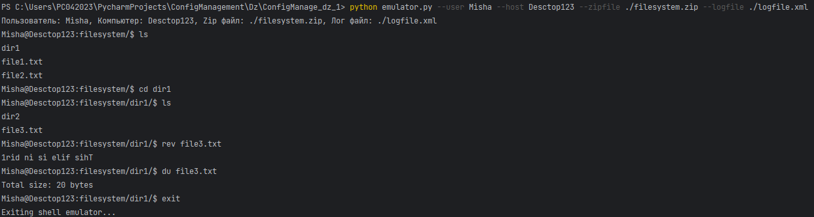
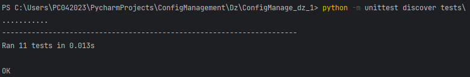

# Emulator Console

Это консольное приложение, которое эмулирует файловую систему и предоставляет базовые команды оболочки UNIX, такие,  как 'ls', 'cd', 'rev', 'du'.

## Установка

### 1. Клонируйте репозиторий:

```bash
git clone https://github.com/MishaNyKarl/ConfigManagement
```

### 2. Перейдите в директорию с приложением для ДЗ_1

```bash
cd ConfigManagement/Dz/ConfigManage_dz_1/
```

### 3. Подготовьте файловую систему

Убедитесь, что файл filesystem.zip находится в директории ConfigManage_dz_1/ или же поменяйте его на свой

### 4. Запуск приложения

```bash
python emulator.py --user <your name> --host <your host> --zipfile ./filesystem.zip --logfile ./logfile.xml
```


#### Пример запуска:
```bash
python emulator.py --user Misha --host Desctop123 --zipfile ./filesystem.zip --logfile ./logfile.xml
```
Описание ключей командной строки:

    - user: Имя Пользователя
    - host: Название компьютера пользователя
    - zipfile: Путь к архиву с файловой системой
    - logfile: Путь к файлу для логирования последнего сеанса


## Использование команд

Приложение поддерживает следующие команды:

    - ls: отобразить содержимое текущего каталога.
    - cd <path>: сменить текущий каталог.
    - rev <filename>: отобразить содержимое файла в обратном порядке.
    - du <path>: отобразить общий размер файлов в каталоге.
    - exit: выйти из эмулятора.

## Примеры использования



<hr />


