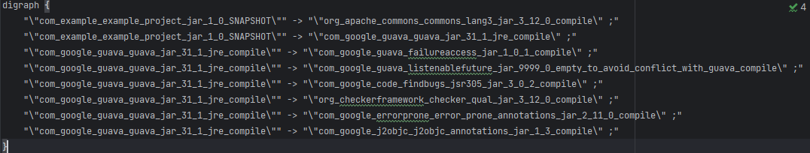

# Визуализатор графа зависимостей Maven

---
Это консольное приложение, которое эмулирует работу с зависимостями Maven и визуализирует их с помощью Graphviz. Оно предоставляет функциональность для анализа и отображения графа зависимостей.

---

## Установка
### 1. Клонируйте репозиторий:
```bash
git clone https://github.com/MishaNyKarl/ConfigManagement
```

### 2. Перейдите в директорию с приложением для ДЗ_2:
```bash
cd ConfigManagement/Dz/ConfigManage_dz_2
```
### 3. Создайте виртуальное окружение и войдите в него:
```bash
python -m venv C:\path\to\new\virtual\environment
./venv/Scripts/activate
```
### 4. Установите зависимости из requirements.txt и перейдите в папку с тестовым приложением maven:
```bash
pip install -r /path/to/requirements.txt
cd example-project
```

### 5. Убедитесь, что у вас установлен Maven и Graphviz:

    Установите Apache Maven и добавьте его в PATH.
    Установите Graphviz и добавьте его в PATH.

## Запуск приложения

Запустите приложение с указанием нужных аргументов командной строки:
```bash
python ./src/cli.py --visualizer <path to visualizer> --package <package name> --repository <repository URL>
```
### Пример:
```bash
python ./src/cli.py --visualizer ./src/graph_builder.py --package com.example:example-project --repository https://repo.maven.apache.org/maven2
```
Описание ключей командной строки:

- visualizer: Путь к файлу, отвечающему за визуализацию графа.
- package: Имя Maven-пакета для анализа зависимостей.
- repository: URL репозитория Maven.

## Использование

Программа выполняет следующие шаги:

- Анализ зависимостей Maven:
    - Использует mvn dependency:tree для извлечения зависимостей указанного пакета.
    - Генерирует файл .dot с информацией о зависимостях.

- Визуализация графа зависимостей:
  - Использует Graphviz для построения и отображения графа в виде изображения.





## Поддерживаемые команды

- Сбор зависимостей:
    Используется Maven для анализа зависимостей пакета.

- Построение графа:
    Graphviz строит граф зависимостей и сохраняет его в формате PNG.

## Пример работы
Входные данные:

- Пакет: com.example:example-project.
- Репозиторий: https://repo.maven.apache.org/maven2.

## Прогон тестов
Тесты:


## Результат:

После выполнения команды создается граф зависимостей, который открывается в вашей системе.
Примеры использования
```bash
python ./src/cli.py --visualizer ./src/graph_builder.py --package com.example:example-project --repository https://repo.maven.apache.org/maven2
```
### Результат:

- Maven анализирует зависимости.
- Программа генерирует граф и сохраняет его в файл dependencies.png.